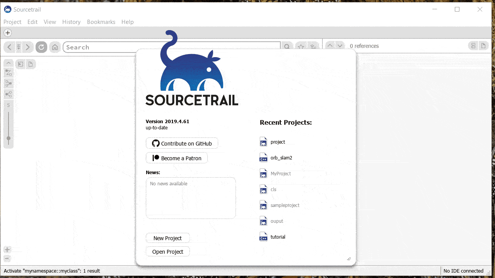

# sourcetrail-cls

**Generate Sourcetrail project for CLS (Common Language Syntax)**

## Build Status

| Linux                                               |
|-----------------------------------------------------|
| [![Build Status][appveyor_status]][appveyor_builds] |

[appveyor_status]: https://ci.appveyor.com/api/projects/status/x9rv935g9ki26i9f?svg=true
[appveyor_builds]: https://ci.appveyor.com/project/shanmukhananda/sourcetrail-cls

## Demo

Sourcetrial project created from [CLS JSON file](data/cls.json)

## Installation

- For Ubuntu/WSL
    - Run `scripts/linux/bootstrap.sh`

- For Visual Studio
    - Install [Visual Studio 2019](https://visualstudio.microsoft.com/vs/) with below Workloads
        - [Desktop development for C++](https://docs.microsoft.com/en-us/cpp/build/vscpp-step-0-installation?view=vs-2019)
        - [Linux development for C++](https://docs.microsoft.com/en-us/cpp/linux/download-install-and-setup-the-linux-development-workload?view=vs-2019)
    - [Install Windows Subystem for Linux](https://docs.microsoft.com/en-us/windows/wsl/install-win10)
    - Launch Ubuntu bash shell and execute `scripts/linux/bootstrap.sh`

## Build

- For Ubuntu/WSL
    - Run `scripts/linux/build.sh`
    
- For Visual Studio
    - Right click on `sourcetrail-cls` folder
    - Choose `Open in Visual Studio`
    - Build > Build All

## Usage

- For Ubuntu/WSL
    - Run `scripts/linux/run.sh`
    - This runs the cls2srctrl app with example CLS input `data/cls.json`. Modify `run.sh` according to your need

- For Visual Studio
    - Select Configuration `WSL-Debug`
    - Select Start Item `sourcetrail-cls.cls2srctrl (src\\cls2srctrl\\sourcetrail-cls.cls2srctrl)` from drop down
    - Lauch using F5 or Green Play Button

## Code Format

Both C++ and CMake files can be formatted using `scripts/linux/code_format.sh`

## Known Issues

- Ouput file will always be `project.srctrldb`
    - Original idea is to parametrize output file by taking the output path as argument
    - If you run the app `sourcetrail-cls.cls2srctrl`, parameter `--srctrldb_output` has no effect 
    - It is possible to create `.srctrldb` file using this idea. But the created file fails to load in Sourcetrail. This needs to be investigated.
    - Output path is hardcoded in file, `src/cls2srctrl/cls2srctr.hpp`, function `cls2st::cls2srctrl::create_srctrldb`
